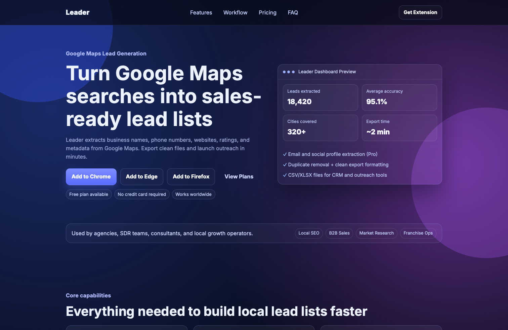
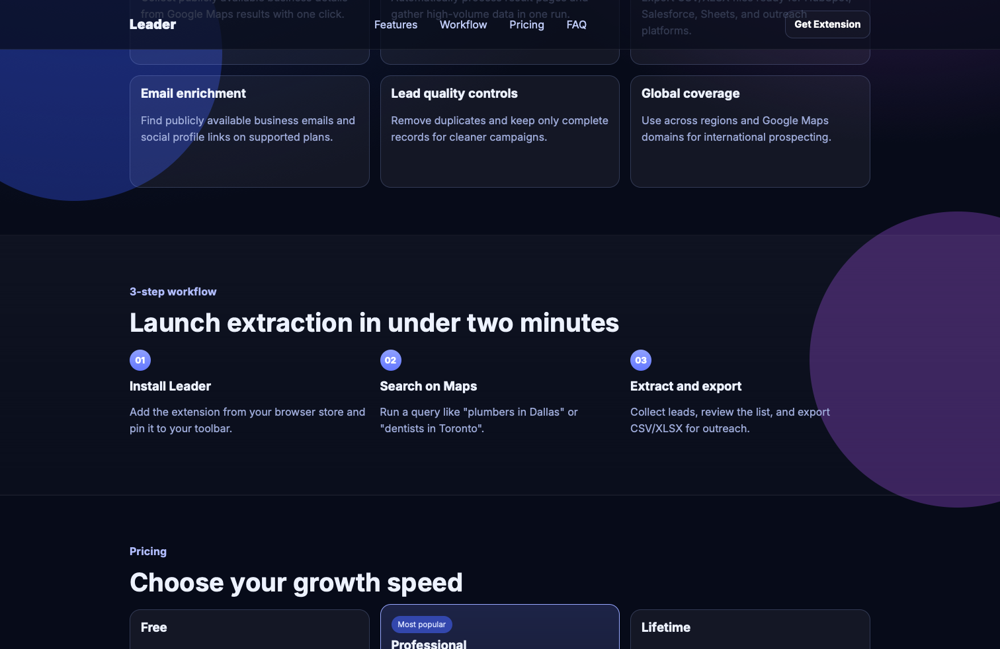
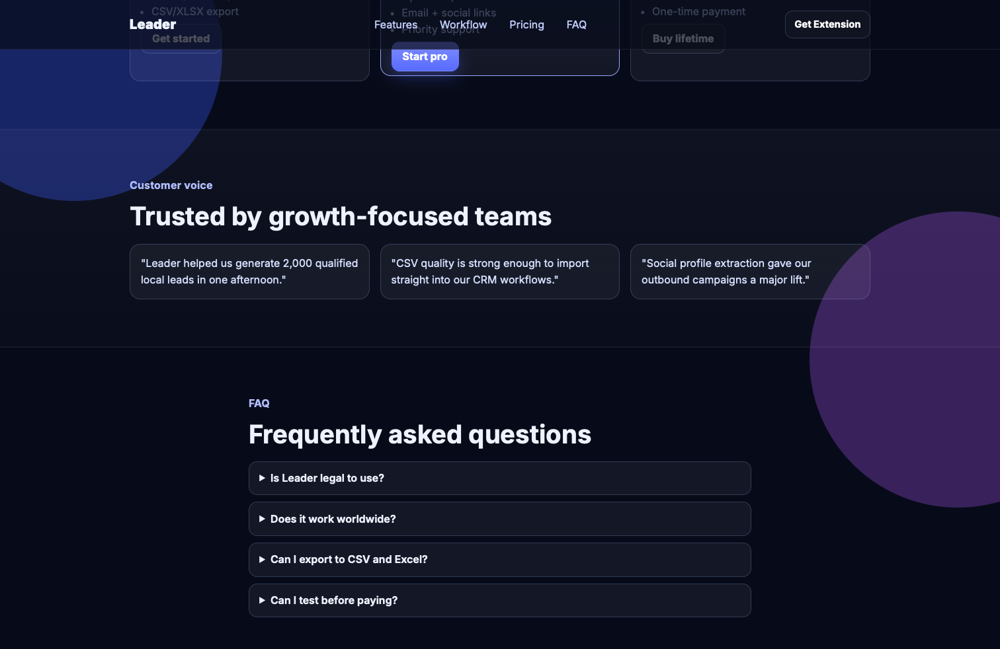
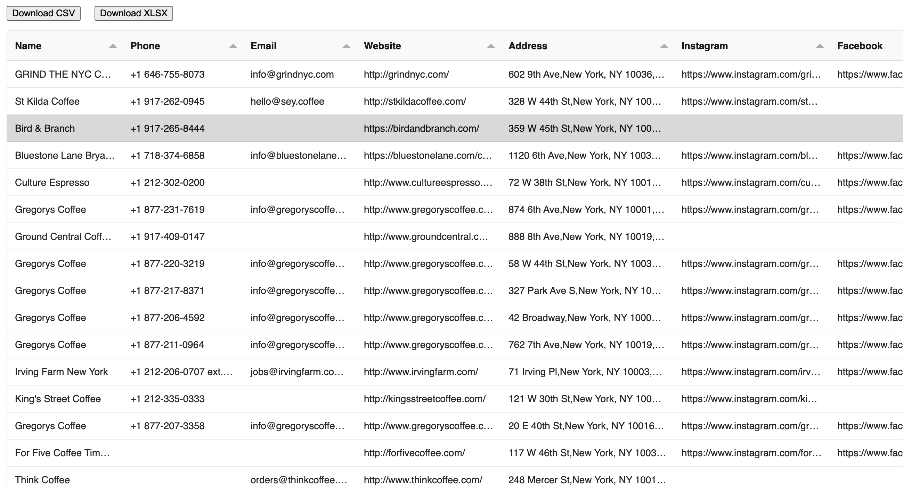
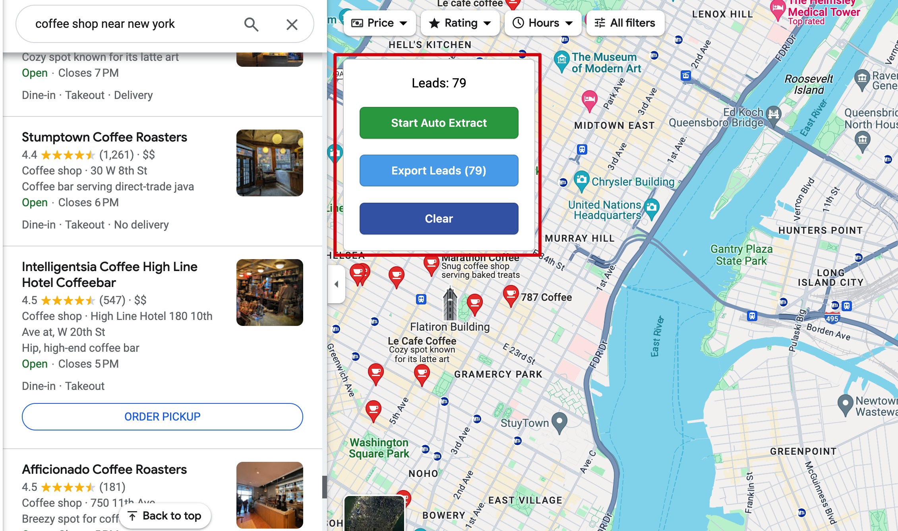
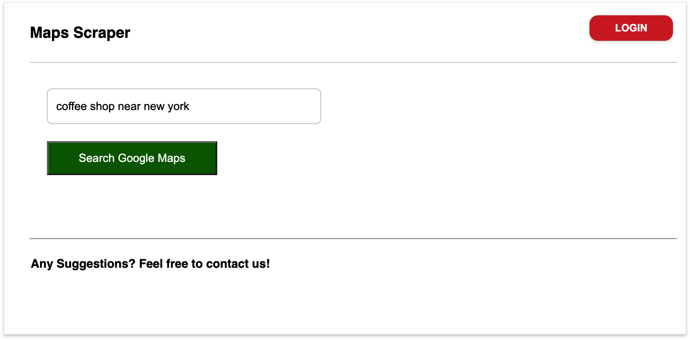

# Leader

Leader is a Google Maps lead extraction extension with a modern marketing website.

It helps teams collect publicly available local business data and export clean files for outreach, CRM imports, local SEO, and market research workflows.

---

## What is included

- **Chrome extension source:** repository root
- **Marketing website source:** `website/`
- **Website screenshots for docs:** `website/screenshot/`
- **Extension screenshots:** `screenshot/`

---

## Website Preview

### Hero Section


### Features Section


### Pricing Section


---

## Extension Preview

### Extracted Data Output


### Main UI


### Popup


---

## Key Features

- Extract business name, phone, website, address, category, ratings, and review count
- Optional email and social profile extraction on paid plans
- Automatic pagination for high-volume result collection
- Duplicate removal for cleaner lead lists
- CSV and XLSX export formats for CRM and spreadsheet workflows
- Works across global Google Maps domains

---

## Run Locally

### 1) Run the website

```bash
cd website
python3 -m http.server 4173
```

Open: `http://localhost:4173`

### 2) Test the extension in Chrome

1. Open `chrome://extensions`
2. Enable **Developer mode**
3. Click **Load unpacked**
4. Select the project folder
5. Open Google Maps and test extraction flow

---

## Configure Browser Download Buttons

Update install links in `website/index.html` after publishing:

- Chrome Web Store URL
- Microsoft Edge Add-ons URL
- Firefox Add-ons URL (optional)

---

## Tech Stack

- Extension: Manifest V3 + vanilla JavaScript
- Website: modern static HTML/CSS/JS (responsive, gradient/glass style)

---

## Legal Note

Google Maps is a trademark of Google LLC.

Leader is an independent tool and is not affiliated with, endorsed by, or sponsored by Google LLC.
